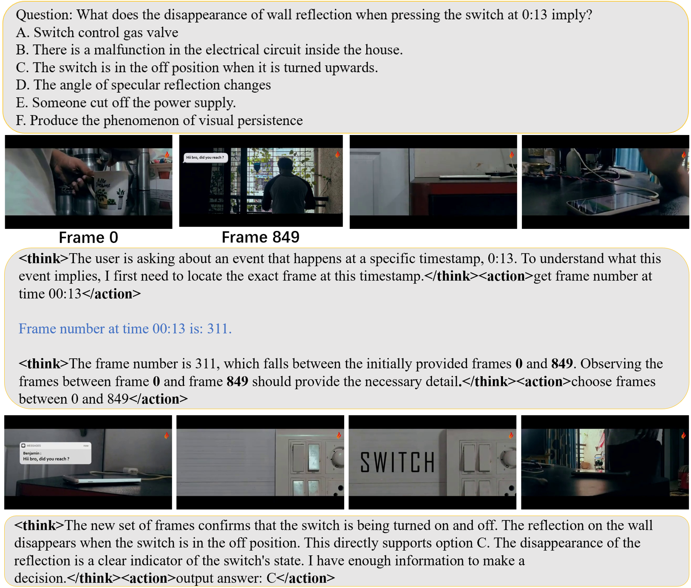
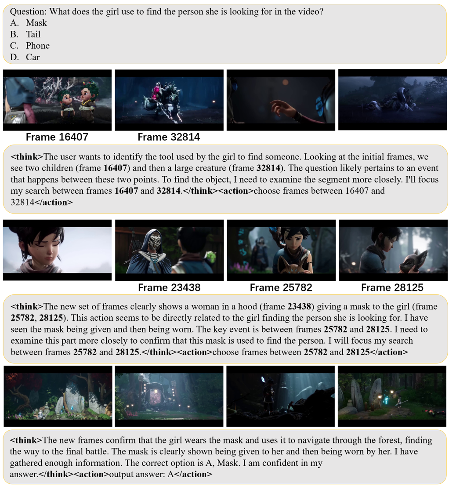

# FrameThinker

This is the official repository for the core code of the paper: **FrameThinker: Learning to Think with Long Videos via Multi-Turn Frame Spotlighting**.

## 📖 About The Project

FrameThinker is a novel framework for long-video reasoning that challenges the inefficient, passive methods of traditional models. Instead of processing a fixed set of pre-sampled frames, FrameThinker **actively** interrogates video content through a **multi-turn, iterative process**. It intelligently spotlights relevant frame sequences to gather evidence, guided by a Cognitive Consistency Verification (CCV) module that ensures its reasoning is logical and interpretable. Across six challenging benchmarks, FrameThinker achieves an **average +10.4% accuracy improvement** over the baseline. As a highlight, it surpasses the strong LongVILA-R1 to set a new state-of-the-art on the LongVideo-Reason benchmark, using just 20.6 frames on average.

<p align="center">
  
  <br>
  <em>An illustration of the FrameThinker framework.</em>
</p>
<p align="center">
  
  <br>
  <em>An example of FrameThinker solving a reasoning task.</em>
</p>

<p align="center">
  
  <br>
  <em>An example of a multi-step reasoning process.</em>
</p>

## 🚀 Getting Started

### Prerequisites

*   Python==3.10
*   vllm==0.9.1
*   transformers==4.52.4
*   Other dependencies listed in `requirements.txt`

### 💾 Data

Our training data is sourced from the following open-source projects:

**[LongVideoReason](https://github.com/NVlabs/Long-RL)**, **[Video-R1](https://github.com/tulerfeng/Video-R1)**,  **[Video-Holmes](https://github.com/TencentARC/Video-Holmes)**, **[CG-Bench](https://github.com/CG-Bench/CG-Bench)**

### ⚙️ Training

```bash
bash examples/agent/train_frame_thinker.sh
```

### 🤝 Merge Checkpoints

```bash
python merge_script.py \
    --backend fsdp \
    --hf_model_path /path/to/original/hf-model \
    --local_dir /path/to/your/checkpoints \
    --target_dir /path/to/save/merged_hf_model
```

### 🚀 Inference & Evaluation

```bash
python examples/agent/infer.py 
```

### 🙏 Acknowledgements

We would like to express our sincere gratitude to the open-source community and the creators of the foundational projects that made this work possible.

Our implementation is built upon the excellent codebases of **[verl](https://github.com/volcengine/verl)** and **[DeepEyes](https://github.com/Visual-Agent/DeepEyes)**. Their work provided a strong foundation and significantly accelerated our research. We highly recommend checking out their projects.